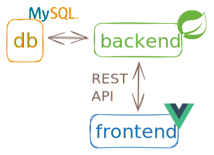

# SVGboard

A full-stack web application for creating and animating SVG graphics with version history.

| | Tests | Coverage |
|---------|-------|----------|
| **Backend** | [](https://github.com/Merwanel/SVGboard/actions/workflows/backend-tests.yml) | [](https://codecov.io/gh/Merwanel/SVGboard) |
| **Frontend** | [](https://github.com/Merwanel/SVGboard/actions/workflows/frontend-tests.yml) | [](https://codecov.io/gh/Merwanel/SVGboard) |




## Features

- **RESTful API**: CRUD operations for projects and snapshots
- **Interactive Canvas**: draw and manipulate shapes with drag-and-drop
- **Animation Timeline**: create multi-track animations
- **Live Code View**: real-time SVG code generation
- **Version Control**: snapshot-based history
- **Project Management**: multiple projects with search and thumbnail previews
- **Auto-Save**: auto-save with manual override

## Tech Stack

**Frontend** : Vue 3 (TypeScript) , Vitest

**Backend** : Spring Boot (Java) , MySQL , JUnit 5 + H2 for testing

**DevOps** : GitHub Actions CI/CD , Docker Compose ,  Codecov integration

## API Endpoints

```
GET    /projects              - List all projects
GET    /projects/latest       - Get most recent project with snapshots
GET    /projects/{id}         - Get project by ID
POST   /projects              - Create new project
PATCH  /projects/{id}         - Update project title
DELETE /projects/{id}         - Delete project

GET    /projects/{id}/snapshots              - Get all snapshots
GET    /projects/{id}/snapshots/{snapshotId} - Get specific snapshot
POST   /projects/{id}/snapshots              - Create snapshot
DELETE /projects/{id}/snapshots              - Delete all snapshots
DELETE /projects/{id}/snapshots/{snapshotId} - Delete snapshot
```

## Setup

**Docker (recommended)**
```bash
docker compose up
```
Access at http://localhost

**Manual Setup**

Backend:
```bash
docker run --name mysql_container -e MYSQL_ROOT_PASSWORD=my-secret-pw -p 3306:3306 -d mysql:9.5.0
cd backend
./mvnw spring-boot:run
```

Frontend:
```bash
cd frontend
npm install
npm run dev
```

**Testing**
```bash
# Backend
./mvnw test

# Frontend
npm run test:coverage
```